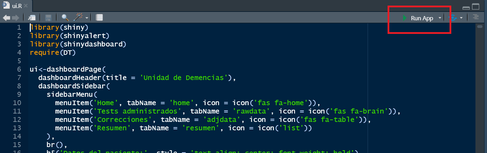
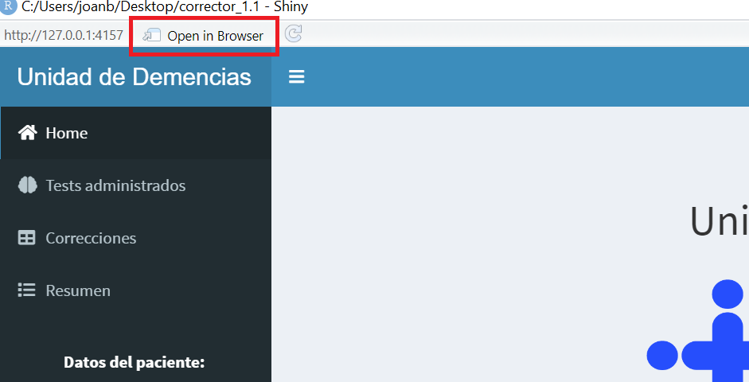
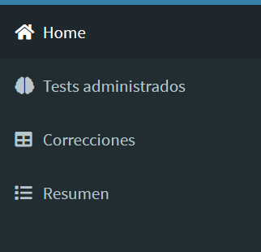
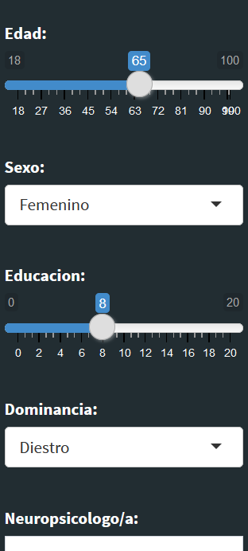
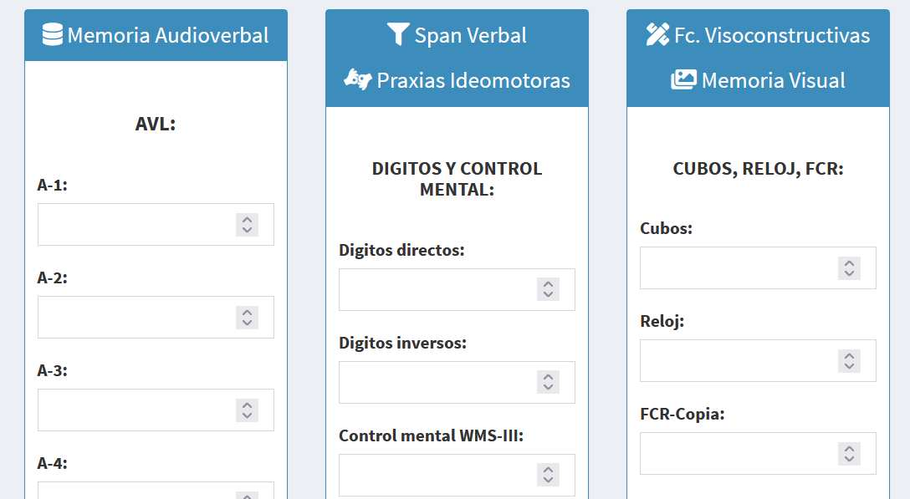
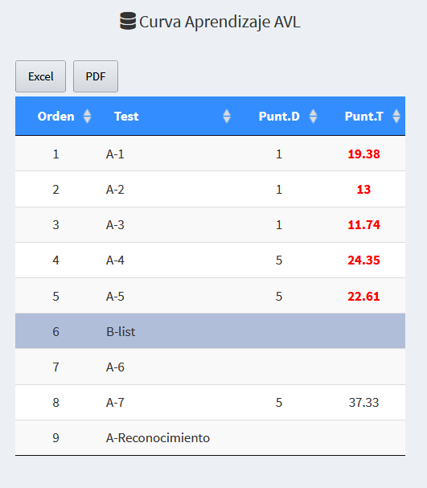
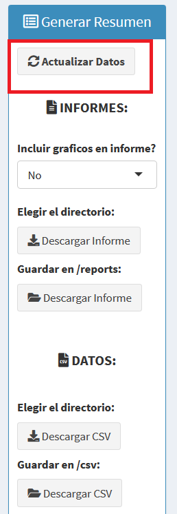

# 0. About

This is an APP created with the purpose of correcting psychometric data in the Dementia Unit of Vall d'Hebron Hospital (Barcelona).
It consists of a GUI created with Shiny and it uses Spanish normative data.  

# 1. Installation and dependencies. 

R v.4.0.2. This project has not been tested using other R versions, but might work with versions >= 4.0.

RStudio. 

## 1.1. Dependencies: 

- Hmisc. 
- car. 
- MASS. 
- nlme. 
- nortest.
- foreign. 
- ggplot2. 
- dplyr. 
- stringr. 
- shiny. 
- shinythemes. 
- reshape2. 
- DT.
- reactlog.
- shinyalert. 
- shinydashboard. 
- knit. 
- kableExtra. 
- gridExtra. 
- repr. 

## 1.3. Installation

Go to the R CRAN and download/install R-base (https://cran.r-project.org/bin/windows/base/old/). Just execute the binary. Then go to the RStudio website and download the RStudio Desktop IDE (https://www.rstudio.com/products/rstudio/download). 
Then, pull this repo and use the '/installation/R config.R' script to configure your workspace. This script just downloads and configure the dependencies. 

# 2. Usage

## 2.1. Launching and using the GUI 

This program works as any other Shiny GUI. Just open from RStudio the "server.R" or "ui.R" scripts and click on "Run app": 

You'll see a new window with the GUI. Click on "open in a browser" for a better visualization:

You can start correcting neuropsych data! The correction consists of 4 tabs: 

Normally you want to start by entering participants' data on the dashboard: 

Introduce the raw data on "Tests administrados" tab: 

You can inspect the normalized data on "Correcciones" tab. And you can export these tables as pdf or excel: 

Finally, go to "Resumen" and **first click on "Actualizar datos"** to update the information. Then you can inspect the plots and download the .csv file and reports. 

Then you can inspect the reports and .csv files. These can be directly saved on "reports" and "csv" folders from your app directory, or you can choose the folder. 

## 2.2. Issues

In this version there is only one bug that has been reported thus far. Avoid [',";] signs on text boxes.

# 3. Normative data

This APP uses Spanish normative data. You have the references at the end of this README. You can contact by email for detailed information.  

# 4. License 

This project is distributed under MIT license. Please, refer to license.txt for further information.

# 5. References

1. Quintana M, Pena-Casanova J, Sanchez-Benavides G, Langohr K, Manero RM, Aguilar M, et al. Spanish multicenter normative studies (Neuronorma project): norms for the abbreviated Barcelona Test. Archives of clinical neuropsychology : the official journal of the National Academy of Neuropsychologists 2011; 26:144-157.
2. Pena-Casanova J, Quintana-Aparicio M, Quinones-Ubeda S, Aguilar M, Molinuevo JL, Serradell M, et al. Spanish Multicenter Normative Studies (NEURONORMA Project): norms for the visual object and space perception battery-abbreviated, and judgment of line orientation. Archives of clinical neuropsychology : the official journal of the National Academy of Neuropsychologists 2009; 24:355-370.
3. Pena-Casanova J, Quinones-Ubeda S, Quintana-Aparicio M, Aguilar M, Badenes D, Molinuevo JL, et al. Spanish Multicenter Normative Studies (NEURONORMA Project): norms for verbal span, visuospatial span, letter and number sequencing, trail making test, and symbol digit modalities test. Archives of clinical neuropsychology : the official journal of the National Academy of Neuropsychologists 2009; 24:321-341.
4. Pena-Casanova J, Quinones-Ubeda S, Gramunt-Fombuena N, Quintana-Aparicio M, Aguilar M, Badenes D, et al. Spanish Multicenter Normative Studies (NEURONORMA Project): norms for verbal fluency tests. Archives of clinical neuropsychology : the official journal of the National Academy of Neuropsychologists 2009; 24:395-411.
5. Pena-Casanova J, Quinones-Ubeda S, Gramunt-Fombuena N, Quintana M, Aguilar M, Molinuevo JL, et al. Spanish Multicenter Normative Studies (NEURONORMA Project): norms for the Stroop color-word interference test and the Tower of London-Drexel. Archives of clinical neuropsychology : the official journal of the National Academy of Neuropsychologists 2009; 24:413-429.
6. Pena-Casanova J, Quinones-Ubeda S, Gramunt-Fombuena N, Aguilar M, Casas L, Molinuevo JL, et al. Spanish Multicenter Normative Studies (NEURONORMA Project): norms for Boston naming test and token test. Archives of clinical neuropsychology : the official journal of the National Academy of Neuropsychologists 2009; 24:343-354.
7. Pena-Casanova J, Gramunt-Fombuena N, Quinones-Ubeda S, Sanchez-Benavides G, Aguilar M, Badenes D, et al. Spanish Multicenter Normative Studies (NEURONORMA Project): norms for the Rey-Osterrieth complex figure (copy and memory), and free and cued selective reminding test. Archives of clinical neuropsychology : the official journal of the National Academy of Neuropsychologists 2009; 24:371-393.
8. Palomo R, Casals-Coll M, Sánchez-Benavides G, Quintana M, Manero RM, Rognoni T, et al. Spanish normative studies in young adults (NEURONORMA young adults project): norms for the Rey-Osterrieth Complex Figure (copy and memory) and Free and Cued Selective Reminding Test. Neurologia (Barcelona, Spain) 2013; 28:226-235.
9. Casals-Coll M, Sánchez-Benavides G, Quintana M, Manero RM, Rognoni T, Calvo L, et al. Spanish normative studies in young adults (NEURONORMA young adults project): norms for verbal fluency tests. Neurologia (Barcelona, Spain) 2013; 28:33-40.
10. Casals-Coll M, Sanchez-Benavides G, Meza-Cavazos S, Manero RM, Aguilar M, Badenes D, et al. Spanish multicenter normative studies (NEURONORMA project): normative data and equivalence of four BNT short-form versions. Archives of clinical neuropsychology : the official journal of the National Academy of Neuropsychologists 2014; 29:60-74.
11. Calvo L, Casals-Coll M, Sánchez-Benavides G, Quintana M, Manero RM, Rognoni T, et al. Spanish normative studies in young adults (NEURONORMA young adults project): norms for the Visual Object and Space Perception Battery and Judgment of Line Orientation tests. Neurologia (Barcelona, Spain) 2013; 28:153-159.
12. Calvo L, Casals-Coll M, Sanchez-Benavides G, Quintana M, Manero RM, Rognoni T, et al. Spanish normative studies in young adults (NEURONORMA young adults project): norms for the Visual Object and Space Perception Battery and Judgment of Line Orientation tests. Neurologia (Barcelona, Spain) 2013; 28:153-159.
13. Alegret M, Espinosa A, Vinyes-Junque G, Valero S, Hernandez I, Tarraga L, et al. Normative data of a brief neuropsychological battery for Spanish individuals older than 49. Journal of clinical and experimental neuropsychology 2012; 34:209-219.

 

